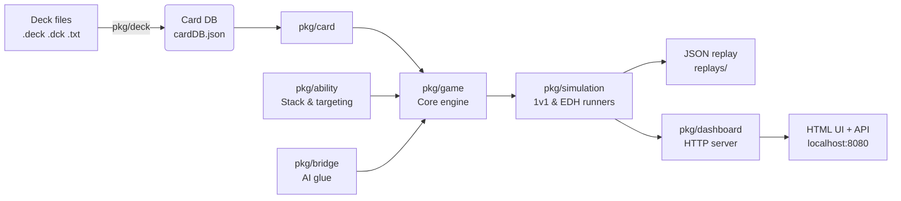

# MTGSim 🎴⚔️

[](https://go.dev)
[](./)
[](LICENSE)

> A headless, automated **Magic: The Gathering** simulator and deck-analysis sandbox written in Go.

MTGSim lets you import decklists, simulate thousands of games, and analyze performance — from quick 1v1 smoke tests to full multiplayer EDH pods with structured replay export. Everything runs locally with a cached Scryfall card database and ships with a built-in web dashboard.

## Four commands, four levels of fidelity

| Command | What it does | Best for |
|---|---|---|
| `mtgsim` | 1v1 simulator with stats, sideboards, and confidence intervals | Smoke-testing and comparing tuned lists |
| `mtgsim-edh` | Multiplayer Commander pods (2–6 players) | EDH meta analysis |
| `mtgsim-dashboard` | Live web dashboard for results | Real-time browsing |
| `stack_demo` | Stack / priority demo | Understanding the engine |

## Feature highlights

- 🧠 **Multiplayer EDH engine** — 2-6 players, 40 life, command zone, commander tax, 21-damage SBA, London Mulligans
- 📊 **Threat-based AI** — attack targeting uses board-state scoring; APNAP-ordered trigger resolution
- 📝 **Replay export** — per-pod structured JSON event logs (turns, casts, combat, eliminations)
- 🌐 **Built-in dashboard** — auto-refreshing HTML UI with 1v1 and EDH endpoints
- 📦 **Flexible deck import** — plain lists, Cockatrice `.dck`, sectioned exports (Moxfield, etc.), inferred commanders
- 🧪 **Comprehensive tests** — full coverage across `pkg/game`, `pkg/ability`, `pkg/simulation`, `pkg/deck`, and `pkg/dashboard`

## Quick decision guide

- **1v1 analysis with confidence intervals** → `mtgsim`
- **EDH pod testing & replay export** → `mtgsim-edh`
- **Browser-based metrics** → `mtgsim-dashboard`

## Requirements

- Go 1.21+ (Go 1.23.x recommended — `go.mod` pins `toolchain go1.23.4`)
- Internet access **only** if `cardDB.json` is missing (one-time Scryfall download)

## Quick start

```sh
git clone https://github.com/mtgsim/mtgsim.git
cd MTGSim
```

On first run the simulator checks for `cardDB.json` in the repo root. If it is missing, it downloads the pinned Scryfall oracle snapshot and caches it locally automatically.

### 1️⃣ Run a 1v1 batch

```sh
go run ./cmd/mtgsim -games=100 -decks=decks/1v1 -v=1
```

**Typical output snippet:**

```text
== Simulation Summary ==
Games: 100 | Total Time: 1.2s | Games/sec: 83

Deck Performance (95% CI)
Red Deck              52      48      52.0%   [42.1%, 61.8%]
Green Deck            48      52      48.0%   [38.2%, 57.9%]

Aggregate Game Metrics
Avg Turns: 8.4
Final Life P1: avg=12.3 min=0 max=20 | P2: avg=8.1 min=0 max=20
```

### 2️⃣ Launch the live dashboard

```sh
go run ./cmd/mtgsim-dashboard -games=200 -decks=decks/1v1 -port=8080
```

Then open **http://localhost:8080** in your browser. The page auto-refreshes every 5 seconds as games finish.

### 3️⃣ Run a 4-player EDH pod batch with replay export

```sh
go run ./cmd/mtgsim-edh -games=25 -pod=4 -decks=decks/edh \
  -mulligans=1 -replay=replays -port=0
```

**Typical output snippet:**

```text
META: Starting 25 4-player pods (seed=1715601023)...
META: Completed 10/25 pods
META: Completed 20/25 pods
META: Simulated 25 pods in 3.1s (avg 12.4 turns/pod)
=== EDH Results ===
Deck Krenko                      G:25  W:12  L:13  WR: 48.0%  AvgLife: 18.3  CmdrDmgKO:3
```

Replay files land in `replays/pod-0001.json`, `replays/pod-0002.json`, etc.

## Building the tools

```sh
go build -o mtgsim          ./cmd/mtgsim
go build -o mtgsim-dashboard ./cmd/mtgsim-dashboard
go build -o mtgsim-edh      ./cmd/mtgsim-edh
go build -o stack_demo       ./cmd/stack_demo
```

## Command overview

| Command | Purpose | Important flags |
|---|---|---|
| `mtgsim` | 1v1 simulator with stats and CI | `-games`, `-decks`, `-swap`, `-v`, `-log` |
| `mtgsim-dashboard` | Runs simulations and serves dashboard UI | `-games`, `-decks`, `-port`, `-keep-alive`, `-log` |
| `mtgsim-edh` | Headless multiplayer EDH / Commander runner | `-games`, `-pod`, `-decks`, `-max-turns`, `-mulligans`, `-replay`, `-sideboard-variants`, `-sideboard-swaps`, `-port`, `-keep-alive`, `-seed`, `-log` |
| `stack_demo` | Demonstrates stack / priority interactions | no flags |

### `mtgsim`

Two-player batch simulator with full mana enforcement, stack-based casting, aggregate metrics, and Wilson-score confidence intervals.

```sh
./mtgsim -games=250 -decks=decks/welcome -log=META
```

Flags:

- `-games N`: number of games to simulate (default `100`)
- `-decks DIR`: recursively scanned deck directory (default `decks/1v1`)
- `-swap N`: swap `N` random sideboard cards into the main deck each game
- `-v N`: verbosity (`0` minimal, `1` summary, `2` per-game details)
- `-log LEVEL`: logger verbosity

### `mtgsim-dashboard`

Runs 1v1 simulations and serves an HTML dashboard at `http://localhost:<port>`.

```sh
./mtgsim-dashboard -games=300 -decks=decks/1v1 -port=8080
```

Notable flags:

- `-games N`: simulations to run (default `50`)
- `-decks DIR`: recursively scanned deck directory (default `decks/1v1`)
- `-port N`: HTTP port (default `8080`)
- `-keep-alive`: keep the server running after the batch completes (default `true`)

### `mtgsim-edh`

Runs multiplayer Commander / EDH pods headlessly and can optionally expose EDH metrics on the same dashboard server.

```sh
./mtgsim-edh -games=50 -pod=4 -decks=decks/edh -mulligans=1 -replay=replays -keep-alive=false
```

Notable flags:

- `-games N`: number of pods to simulate (default `50`)
- `-pod N`: players per pod, from `2` to `6` (default `4`)
- `-decks DIR`: recursively scanned deck directory (default `decks`)
- `-max-turns N`: hard turn cap per pod (default `50`)
- `-mulligans N`: London Mulligans each player takes before turn 1
- `-seed N`: RNG seed (`0` means time-based)
- `-replay DIR`: write one JSON replay per pod
- `-sideboard-variants N`: generate `N` sideboard-swap variants per imported deck
- `-sideboard-swaps N`: number of cards swapped for each generated variant (default `3`)
- `-port N`: dashboard port; set `0` to disable dashboard startup
- `-keep-alive`: keep dashboard alive after simulations finish (default `true`)

Important note: because the default EDH deck root is `decks`, `mtgsim-edh` will recurse through every subdirectory under `decks/`. If you want only Commander lists, prefer `-decks=decks/edh`.

### `stack_demo`

`stack_demo` demonstrates spell casting, priority passing, counterspells, stack resolution, and sorcery timing restrictions.

```sh
./stack_demo
```

## Dashboard & API

When a dashboard-capable binary (`mtgsim-dashboard` or `mtgsim-edh`) is running, the server exposes a dark-themed auto-refreshing HTML UI plus JSON endpoints you can query directly.

### Endpoints

| Endpoint | What it returns | Available from |
|---|---|---|
| `GET /` | Dark HTML dashboard with live tables | Any dashboard binary |
| `GET /api/health` | `{"status":"healthy"}` | Any dashboard binary |
| `GET /api/results` | 1v1 win/loss aggregates | Any dashboard binary |
| `GET /api/edh-results` | EDH per-deck stats + summary telemetry | `mtgsim-edh` only |
| `GET /api/edh-games` | Recent EDH pod records (latest 10) | `mtgsim-edh` only |

### Example API queries

```sh
# 1v1 leaderboard
curl -s http://localhost:8080/api/results | jq '.decks[:3]'

# EDH aggregate telemetry (requires mtgsim-edh)
curl -s http://localhost:8080/api/edh-results | jq '.summary'

# Recent pod replays (requires mtgsim-edh)
curl -s http://localhost:8080/api/edh-games | jq '.games[0] | {winner, turns, players}'
```

### HTML dashboard preview

The UI auto-refreshes every 5 seconds and shows:

- **Summary cards** — total games, unique decks, average turns
- **Deck rankings** — sortable win-rate table
- **EDH telemetry** (when running `mtgsim-edh`) — pods, highest storm count, total mana spent, combat damage, eliminations
- **Recent pods** — winner, turns, per-player mana/cards played, and final event

## Deck file formats

Deck discovery is recursive and filename-agnostic. In practice, this repo contains `.deck`, `.dck`, and `.txt` deck exports. The importer parses deck contents rather than depending on a specific extension.

Supported patterns include:

### Plain list

```txt
4 Lightning Bolt
3 Mountain
20 Forest
```

### Sectioned list

```txt
About
Name My Awesome Deck

Deck
4x Lightning Bolt (CLB) 401
3x Mountain (DSK) 283

Sideboard
2x Naturalize (M19) 190
```

### Commander / EDH-friendly sections

```txt
COMMANDER:
1 Krenko, Mob Boss

DECK
99 other cards...

SIDEBOARD
5 flex cards...
```

The Commander importer also handles common export conventions such as:

- `Commander`, `Command Zone`, `Deck`, and `Sideboard` section headers
- `SB:` inline lines used by Cockatrice-style exports
- `COMMANDER:` inline lines
- `NAME:` deck titles
- Moxfield/Cockatrice-style final command-zone groups

Commander imports validate card color identity against the designated commander(s). Sideboard cards are also checked because the EDH runner can generate sideboard-swap variants.

## Repository layout

```text
MTGSim/
├── cmd/                  # CLI entry points
│   ├── mtgsim/
│   ├── mtgsim-dashboard/
│   ├── mtgsim-edh/
│   └── stack_demo/
├── pkg/
│   ├── ability/          # Ability parsing, targeting, stack, priority, AI glue
│   ├── bridge/           # Bridges between game state and ability systems
│   ├── card/             # Card models, mana parsing, card database loader
│   ├── dashboard/        # HTTP server and HTML dashboard
│   ├── deck/             # Deck import and commander validation
│   ├── game/             # Core rules engine and zones
│   └── simulation/       # 1v1 / EDH runners, results, utilities, threat logic
├── internal/logger/      # Internal logging helpers
├── decks/                # Sample 1v1 and EDH decklists
├── meta/                 # Deck generation utilities
└── cardDB.json           # Cached Scryfall oracle DB (created/updated locally)
```

## Architecture overview



**Flow in words:**
1. **Deck import** (`pkg/deck`) recursively reads lists, infers command zones, and validates color identity against the cached Scryfall oracle database (`pkg/card`).
2. **Game engine** (`pkg/game`) runs headless turn/phase loops, combat with first-strike timing, layered continuous effects, triggers, state-based actions, and commander damage.
3. **Ability & bridge layers** (`pkg/ability`, `pkg/bridge`) extend the engine with stack handling, targeting, timing checks, and AI-assisted casting.
4. **Simulation runners** (`pkg/simulation`) orchestrate 1v1 pairings or EDH pods, aggregate metrics, apply threat-based attack targeting, and optionally write per-pod JSON replays.
5. **Dashboard** (`pkg/dashboard`) serves both the auto-refreshing HTML UI and the JSON API endpoints.

## Rules engine highlights

The `pkg/game` engine is intentionally headless and focused on simulation workflows. Current engine capabilities in the checked-in code include:

- turn / phase progression and cleanup
- combat with blockers and first-strike / double-strike timing
- keyword handling used by combat and state-based actions
- layered continuous effects for power/toughness changes
- triggers, watchers, and event-driven game hooks
- damage prevention and replacement-effect hooks
- commander bookkeeping (command zone, tax, commander damage)
- multiplayer APNAP trigger ordering

The `pkg/ability` and `pkg/bridge` packages extend this with stack handling, targeting, timing checks, and AI-assisted activation / casting in the more detailed simulation paths.

## Sample deck directories

- `decks/1v1`: basic two-player test decks
- `decks/welcome`: simple monocolor intro-style lists
- `decks/vanilla`: creature-heavy lower-complexity lists
- `decks/novelty`: themed examples
- `decks/edh`: Commander / EDH exports used by the multiplayer runner

## Current limitations

- **Simulation fidelity** — `mtgsim` is a batch simulator, not a full competitive MTG AI. It uses heuristics rather than exhaustive search.
- **Instant-speed interaction** — The EDH runner auto-plays lands, commanders, castable non-instant permanents, combat, and main-phase abilities. Rich instant-speed play is not enabled by default.
- **Opponent priority** — The EDH opponent-priority hook exists, but the default handler is a no-op. Custom priority handlers can be wired in via `pkg/game`.
- **Replay playback** — JSON replays are write-only today. A deterministic replay-import CLI is not yet implemented.
- **Deck discovery** — Recursive directory scanning does not filter by file extension. Keep sideboard drafts and non-deck files out of the scanned tree.

## Development

Run the standard checks from the repository root:

```sh
go test ./...
go vet ./...
```

If you want a quick manual smoke test, these are the highest-signal commands:

```sh
go run ./cmd/mtgsim -games=10 -decks=decks/1v1
go run ./cmd/mtgsim-edh -games=2 -pod=4 -decks=decks/edh -port=0
```

## Contributing

Contributions are welcome. Please see [CONTRIBUTING.md](CONTRIBUTING.md) if you are contributing through a fork or PR workflow.

## License

This project is licensed under the MIT License. See [LICENSE](LICENSE).

## Acknowledgments

- [Scryfall](https://scryfall.com/) for the oracle card data used by the local card database cache
- The MTG community for the rules references, deck exports, and inspiration behind the simulator